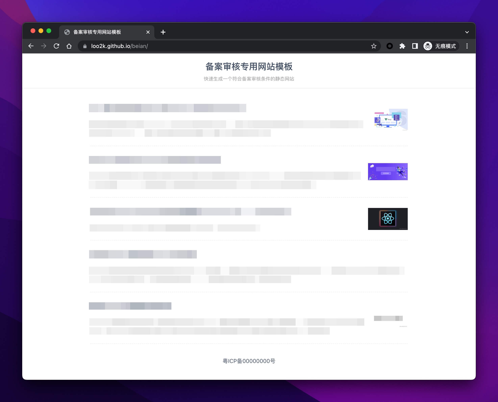

# 网站备案审核模板

[](https://loo2k.github.io/beian/)

这里的网站备案指的是 [ICP 备案和公安备案](https://cloud.tencent.com/product/ba)，备案过程中工信部会对你的网站进行审核。

在更早之前，你只需要放一个网站维护中的界面即可通过审核。但是，工信部的审核变得越来越严格，需要审核你的网站名称、网站内容以及是否悬挂备案号等信息。

这个仓库的目标是快速生成一个符合备案审核条件的静态网站（填充从网络上自动抓取的内容）用于工信部的审核。

## 特色功能

- 📦 开箱即用 仅三行配置
- 🌐 随机内容 避免重复内容
- ⚡ 纯静态站点 部署简单成本低
- 👁️‍🗨️ 经过管局审核通过的模板 更高通过率

## 如何使用

### 克隆项目代码

```sh
git clone https://github.com/loo2k/beian.git
```

### 安装项目依赖

```sh
npm install
```

_请确保你已经安装了 [Nodejs](https://nodejs.org/) 且版本号大于或等于 `14`_

### 修改网站配置信息

编辑 `nuxt.config.ts` 文件的 `appConfig` 属性，修改为自己需要备案的网站信息

```ts
{
  // ....
  appConfig: {
    title: '输入网站的备案名称',
    description: '输入网站的描述',
    beian: '输入网站的备案号'
  }
}
```

### 生成静态文件

```sh
npm run generate
```

### 发布上线

将 `./dist` 目录下的文件打包上传到你的站点即可，[查看演示效果](https://loo2k.github.io/beian/)

## 进阶玩法

### 拉取不同的数据

生成静态文件的时候会实时从[掘金热榜/前端](https://juejin.cn/frontend?sort=three_days_hottest)拉取最新的 10 篇文章作为站点内容。

你可以通过修改 `server/api/articles/index.ts` 或 `server/api/articles/[id].ts` 来改变抓取的数据源。

### 技术框架

- [Vue3](https://vuejs.org/)
- [Vite](https://vitejs.dev/)
- [Nuxt3](https://v3.nuxtjs.org/)

## 贡献代码

当前模板只通过了广东管局的审核（2022年10月），仅代表在广东范围内是可用的。随着时间的迁移审核的政策会不断的变化。

作者无法尝试所有省的审核流程，如果你所在的管局有不同的审核要求，可以通过 PR 提交响应的审核内容。
